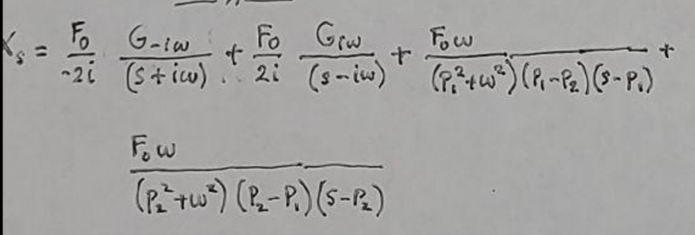
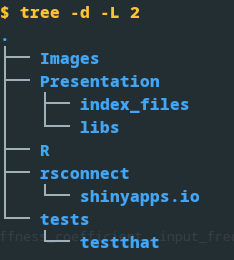

background-image: url(https://kidsactivitiesblog.com/wp-content/uploads/2014/11/25-best-math-apps-no-text.jpg)
background-position: 50% 50%
background-size: 487px 731px
#From Math to App

        
```{r setup, include=FALSE}
options(htmltools.dir.version = FALSE)
```

```{r xaringan-themer, include=FALSE, warning=FALSE}
library(xaringanthemer)
style_mono_accent(
  base_color = "#3e2f5b",
#  base_color = "#1c5253",
#  header_font_google = google_font("Josefin Sans"),
#  header_font_google = google_font("Noto Sans Japanese"),  
  header_font_google = google_font("Merriweather"),
#  text_font_google   = google_font("Montserrat", "300", "300i"),
  text_font_google   = google_font("Raleway", "400", "300i"),
#  code_font_google   = google_font("Fira Mono"),
  code_font_google   = google_font("Fira Code", "400", "500")
)
```

```{r library-setup, warning=FALSE, include=FALSE, echo=FALSE}
libraries=c("xaringanExtra", "emo")
for(lib in libraries) {
  if((lib %in% rownames(installed.packages()))) {
    do.call('library', list(lib))
  } else {
    tryCatch( 
      {install.packages(lib)}
      , warning = function (warn) {
        if ( lib == 'emo') {
          devtools::install_github("hadley/emo")
        }
      }
      , error = function(err) {
        if (lib == "emo") {
          devtools::install_github("hadley/emo")
        } else if ( lib == "xaringanExtra" ) {
          install.packages("remotes")
          remotes::install_github("gadenbuie/xaringanExtra")
        }
      }
    )
    do.call('library', list(lib))
  }
}
```

???

Image credit: [Medium.com](https://kidsactivitiesblog.com/62914/25-best-math-apps-kids-ages/)

.presenter-notes-small[This talk is not about making apps to make your kid/nephew/niece/small-person in your life smarter while spending quality scree-time.]

---
class: center, middle

## This talk is about solving a problem using Math/Stats and then sharing it via an App

### All using R 

---
class: center, middle

## What is the problem?

???
  
.presenter-notes-small[ ]  
---

class: left, inverse

#A mass-spring system driven by an external oscillating force

Source: Fluids and Waves, Roger Moore. Department of Physics, University of Alberta. 2015


???

---
class: left
  
#This is system is modelled with Newton's Second Law

\begin{align*}
\underbrace{m \ddot{x}}_{\text{mass}\times\text{acceleration}}  &= \underbrace{-kx}_{\text{stiffness}\times\text{displacement}} - \underbrace{c\dot{x}}_{\text{damping}\times\text{speed}} + \underbrace{F_0 sin(\omega t)}_{\text{input force}\times \text{sin(frequency}\times\text{time)}}
\end{align*}


???

.presenter-notes-small[

The solution to the linear ordinary differential equation that describes the
motion of the mass attached to the spring is composed of two superimposed
solutions:
1. One due to the homogeneous differential equation resulting when 
the external force is zero.
1. The other from the imposition of the external oscillating force.
]

---
class: inverse, middle, center

## Mathematical modelling

---
class: left

##The ODE for a harmonic oscillator

We start with the general linear ODE. 

Transform it to the Laplace domain because it is more manageable.  

--

.pull-left[
From time domain to Laplace domain

```{r math-intro-ODE-time-laplace, eval=TRUE, echo=FALSE}
knitr::include_graphics("math_ODE_to_Laplace_domain.png")
```
]

--

.pull-right[
Definitions and terms

```{r math-intro-defs-roots_poles, eval=TRUE, echo=FALSE}

```
]


---
class: left

## Three cases from the transfer function

--

.pull-left[


```{r math-intro-three-cases-complementary-solution, eval=TRUE, echo=FALSE}

```
]

--

.pull-right[
```{r math-intro-under-damped-also-real, eval=TRUE, echo=FALSE}

```
]


---
class: left

## The complementary solution 

This usually describes the immediate response of the system after time zero

---
class: left

### Case 1: Two distinct real poles

--

.pull-left[

```{r math-two-distinct-real-poles_fractions, eval=TRUE, echo=FALSE}

```
]

--

.pull-right[
```{r math-two-distinct-real-poles-laplace, eval=TRUE, echo=FALSE}

```

```{r math-two-distinct-real-poles-time, eval=TRUE, echo=FALSE}

```

This is the over-damped case. The transient solution quickly disappears.

]


---
class: left

### Case 2: Two repeated real poles

--

.pull-left[

```{r math-two-repeated-real-poles-fractions-ABC, eval=TRUE, echo=FALSE}

```

]

--

.pull-right[
```{r math-two-repeated-real-poles-freactions-D, eval=TRUE, echo=FALSE}

```

Now we substitute in to the Laplace solution.
]


---
class: left

### Case 2: Two repeated real poles (Cont.)

--

.pull-left[

```{r math-two-repeated-real-poles-laplace, eval=TRUE, echo=FALSE}

```
This is the critically-damped system.

Only happens under special conditions and it is hard to solve.

]

--

.pull-right[

```{r math-two-repeated-real-poles-time, eval=TRUE, echo=FALSE}

```
]


---
class: left

### Case 3: Two complex conjugate poles 

--

.pull-left[

```{r math-two-complex-conjugate-fractions, eval=TRUE, echo=FALSE}

```
]

--

.pull-right[

```{r math-two-complex-conjugate-fractions-solution-with-complex-conj, eval=TRUE, echo=FALSE}

```
We know the shape of this solution from Case 1, only now the roots are
complex conjugates.

]

---
class: left

### Case 3: Two complex conjugate poles (Cont.)

--

.pull-left[

```{r math-two-complex-conjugate-replacing-values-q1-q2, eval=TRUE, echo=FALSE}

```
]

--

.pull-right[

```{r math-two-complex-conjugate-q1-q2-also-must-be-complex-conj, eval=TRUE, echo=FALSE}

```
The constants q1 and q2 must also be complex conjugates.

We could have just left a single constant q in the formula.
]

---
class: left

### Case 3: The complimentary solution (Cont.)

--

.pull-left[

```{r math-two-complex-conjugate-solving-for-C, eval=TRUE, echo=FALSE}

```
]

--

.pull-right[

```{r math-two-complex-conjugate-, eval=TRUE, echo=FALSE}

```

This effort allows us to calculate the complimentary solution in  the time domain given the known real coefficients of the ODE.

This is referred to as the under-damped harmonic oscillator.

]

---
class: left

#### The particular solution

.pull-left[
```{r math-particular-solution, eval=TRUE, echo=FALSE}

```
]

.pull-right[
It comes from the external oscillating force. 

It never stops, that is why it is the steady state solution.

It is added to the complimentary solution which always tends to rest. 

]

---
class: inverse, middle, center

## The software development

This is the coding step


---
class: left

## Organization and project structure

Here is where we separate components of the application.



---
class: left

## An R Project's structure

The folder where the project is defined is the project's root.

Every other path starts at the root within a project.


---
class: left

## Where the code goes

Here are the code files filtered by their extension


---
class: left

## Where the images go

Here are the image files filtered by extension


---
class: left

## Package here 101

--

-File inclusion using `source` and the package `here`

--

-We need to be able to bring functions from other files into the current one.

--

```{r install-Hadley-emo, echo=FALSE, warning=FALSE, include=FALSE}
devtools::install_github("hadley/emo")
```

```{r no-path-doesnot-work, eval=FALSE}
source("compute_Giw.R") #<<
```

####`r emo::ji("-1")` this does not work because it lacks a path from the root

--

```{r hard-coded-path-works, eval=FALSE}
source("R/compute_Giw.R") #<<
```

####`r emo::ji("+1")` this works because it has the full path from the root
--

```{r here-well, eval=FALSE}
library(here) 
source(here("R", "compute_Giw.R")) #<<
```

####`r emo::ji("+1")` this works because it uses here to build a path from root


---
class: left

## Nested file inclusion 

This is a way to visualize a nested code inclusion 


---
class: left

## Package here to the rescue

--

We are writing tests in 

`tests/testthat/test-compute_displacement.R` 

--

The test file must include the CUT (code under test)

--

```{r sourcing-the-CUT, eval=FALSE}
# in tests/testthat/test-compute_displacement.R
# source("../../R/compute_displacement.R") 
library(here)
source(here("R","compute_displacement.R)) #<<
```

--

In the file `compute_displacement.R` we may include other code files:

```{r sourcing-from-the-sourced, eval=FALSE}
# source("R/compute_Giw.R") 
source(here::here("R","compute_Giw.R")) #<<

```
--

Without the package `here` the nested inclusion would have failed because the 
current working folder would be `/tests/testthat/` and the path to `R/compute_Giw.R` 
does not exist under it.

---
class: left

## Nested file inclusion (recap)

Relative paths to the project root stay honest! Use `here`: 


---
class: left

## Testing the smallest units of code

Make small functions that do one thing only.

And do it well.

[Live demo, changing a function name]

Code in https://github.com/padames/lumped-model-dynamics


---
class: left

## Package testthat to the rescue

Unit testing small code units.

This will keep all tidy and easy to refactor.

In RStudio, when you are working in a code file like 

`compute_complimentary_solution.R`

and you type the following in the console:

--

```{r usethis-to-open-test-file, eval=FALSE}
usethis::use_test()#<<
```

--

A corresponding test file is created or opened:

```{r result-of-usethis-use-test, eval=FALSE}
✔ Setting active project to "/home/pablo/git/spring-dynamics".
☐ Modify tests/testthat/test-compute_complementary_solution.R.
```

--

Now you can press the button to run the tests in the file.


---
class: left

## Package usethis to go back and forth


In RStudio, when the file in the editor is 

`test-compute_complimentary_solution.R`

and you type the following in the console:

--

```{r usethis-to-open-cut-file, eval=FALSE}
usethis::use_r()#<<
```

--

The following file opens:

```{r result-of-usethis-use-r, eval=FALSE}
☐ Modify R/compute_complementary_solution.R.
```

--

So you can find the test files for a given CUT and vice-verso easily.


---
class: left

## Using testthat at the console


```{r running-all-tests-at-the-console, eval=FALSE}
testthat::test_dir("tests/testthat")
```

--

```{r testthat-run-all-tests-results, eval=FALSE}
✔ | F W  S  OK | Context
✖ | 1        2 | compute_complementary_solution                                         
────────────────────────────────────────────────────────────────────────────────────────
Failure (test-compute_complementary_solution.R:61:3): complex conjugate constant for under damped case computes correctly
`calculated_constant` not equal to `expected_constant`.
Mean relative Mod difference: 742.8747
────────────────────────────────────────────────────────────────────────────────────────
✔ |          6 | compute_desplacement                                                   
✔ |          1 | compute_Giw                                                            
✔ |          9 | pole_types                                                             

══ Results ═════════════════════════════════════════════════════════════════════════════
── Failed tests ────────────────────────────────────────────────────────────────────────
Failure (test-compute_complementary_solution.R:61:3): complex conjugate constant for under damped case computes correctly
`calculated_constant` not equal to `expected_constant`.
Mean relative Mod difference: 742.8747

[ FAIL 1 | WARN 0 | SKIP 0 | PASS 18 ]
Error: Test failures
```


---
class: left

### Using testthat at the console (Cont.)


--

Once all the test have been fixed.


```{r testthat-run-all-tests-pasing, eval=FALSE}
testthat::test_dir("tests/testthat")
```

--

```{r result-testthat-all-tests-passing, eval=FALSE}
✔ | F W  S  OK | Context
✔ |          3 | compute_complementary_solution                                         
✔ |          6 | compute_desplacement                                                   
✔ |          1 | compute_Giw                                                            
✔ |          9 | pole_types                                                             

══ Results ═════════════════════════════════════════════════════════════════════════════
[ FAIL 0 | WARN 0 | SKIP 0 | PASS 19 ]
```


---
class: left

### Time management (for time travel)

Version control. It can be intimidating but essential.

[live demo]

---
class: left, top, show-only-last-code-result

### The program structure

Main function: `displacement_fn`

Where is: `R/compute_displacement.R`

Arguments: A list of named values.

--

```{r main-funtion-argument-unwrap, eval=FALSE}
displacement_fn <- function(arguments)
{
                 mass  <-  arguments$mass
              damping  <-  arguments$damping
            stiffness  <-  arguments$stiffness
            frequency  <-  arguments$frequency
          input_force  <-  arguments$input_force
  seconds_to_simulate  <-  arguments$seconds_to_simulate  
  # ... function code
}
```

---
class: left, top, show-only-last-code-result

### The program structure (Cont.) 

The rest of the main function is shown below:

```{r main-function-body, eval=FALSE}
displacement_fn <- function(arguments)
  # ...
  complementary_fn <- create_complementary_solution_function_fn(mass, damping, stiffness, input_force, frequency)
  complementary_solution <- complementary_fn(seconds_to_simulate)
  
  particular_fn <- create_particular_solution_function_fn(mass, damping, stiffness, frequency)
  particular_solution <- particular_fn(input_force, seconds_to_simulate)
  
  displacement <- particular_solution + complementary_solution
  
  displacement
}
```


---
class: left, top, bold-last-item

### The program workflow 

The order of function execution within `displacement_fn` is:

1. Call `create_complementary_solution_function_fn`

--

2. Call the object returned by above with the `seconds_to_simulate`

--

3. Store the above result as the complementary solution vector

--

4. Call `create_particular_solution_function_fn`

--

5. Call the object returned above with the `input_force` and `seconds_to_simulate`

--

6. Store the above result as the particular solution vector

--

7. Add the two vectors

--
 
8. Return the total solution vector to the caller


---
class: left, top

### The details of the complementary solution

```{r the-complementary-function, eval=FALSE}
create_complementary_solution_function_fn <- function(mass, damping, stiffness, input_force, frequency) 
{
  poles_type = pole_type_fn(mass, damping, stiffness)
  
  if (poles_type == pole_types$TWO_REAL_DISTINCT)#<<
  {
    create_complementary_function_roots_real_distintc_fn(mass, damping, stiffness, input_force, frequency)#<<
  }
  else if (poles_type == pole_types$TWO_COMPLEX_CONJUGATE)
  {
    create_complementary_function_roots_complex_conjugate_fn(mass, damping, stiffness, input_force, frequency)
  }
  else
  {
    create_complementary_function_roots_real_repeated_fn(mass, damping, stiffness, input_force, frequency)
  }
}
```

---
class: left, top

### The functions to  create solutions

```{r function-to-create-solutions, eval=FALSE}
create_complementary_function_roots_real_distintc_fn <- function(mass, damping, stiffness, input_force, frequency)#<<
{
  poles <- compute_two_real_poles_fn(mass, damping, stiffness)
  p1 <- poles$pole1
  p2 <- poles$pole2
  q_num <- input_force * frequency
  q1_den <- (p1*p1 + frequency*frequency) * (p1 - p2)
  q2_den <- (p2*p2 + frequency*frequency) * (p2 - p1)
  q1 <- q_num / q1_den
  q2 <- q_num / q2_den

  function(seconds_to_simulate) {
    num_time_points_to_simulate <- length(seconds_to_simulate)
    q1_v <- rep(q1, times = num_time_points_to_simulate)
    q2_v <- rep(q2, times = num_time_points_to_simulate)
    p1_v <- rep(p1, times = num_time_points_to_simulate)
    p2_v <- rep(p2, times = num_time_points_to_simulate)
    
    q1_v * exp(p1_v*seconds_to_simulate) + q2_v * exp(p2_v * seconds_to_simulate)  
  }
}
```

---
class: left, top, show-only-last-code-result

### How to use 

--
Example call:

```{r eval-entry-function, eval=FALSE}
displacement_fn( list( mass                = 5,
                       damping             = 7,
                       stiffness           = 0.5,
                       frequency           = 3,
                       input_force         = 2,
                       seconds_to_simulate = seq(0,300,01)))
```

--

Results:

```{r results-main-function-call, eval=FALSE}
 [1]  1.040785e-01  3.534807e-01  4.539975e-01  3.859534e-01  4.265063e-01
 [6]  3.280247e-01  3.780069e-01  2.741493e-01  3.322134e-01  2.301508e-01
 ...
[291] -2.498734e-02  2.926121e-02 -3.294942e-02  3.597814e-02 -3.828676e-02
[296]  3.982907e-02 -4.057420e-02  4.050724e-02 -3.962952e-02  3.795863e-02
[301] -3.552798e-02
```


---
class: inverse, middle, center

## The visualization of results


---
class: left

### Start simple


Using the basic R plot function.


---
class: left

### Move up to interactive plots

Using the library plotly `plot_ly` function.


---

class: left

### Move up to interactive Shiny app

Using the library `shiny`.

[live demo]


App in: https://padames-shiny.shinyapps.io/spring-dynamics/

---

class: center, middle

# Thanks!

Slides prepared with [**xaringan**](https://github.com/yihui/xaringan) and  [**xaringanthemer**](https://pkg.garrickadenbuie.com/xaringanthemer/)


